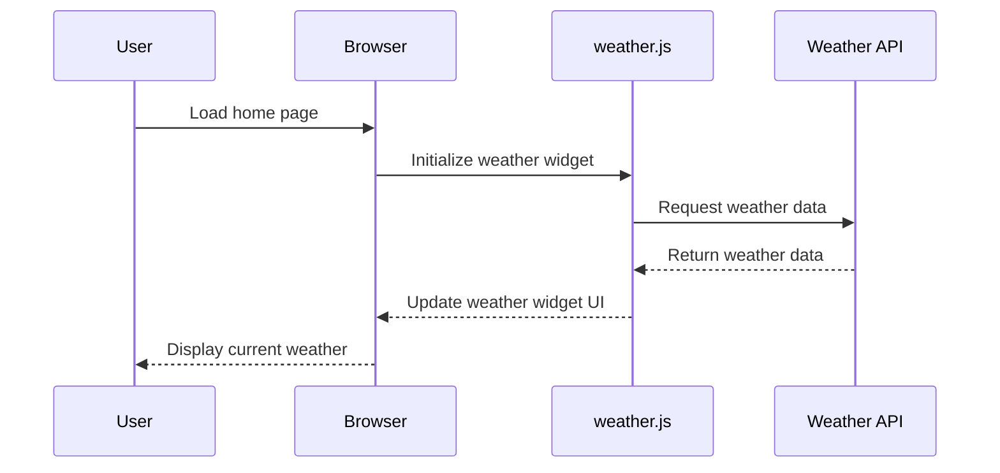
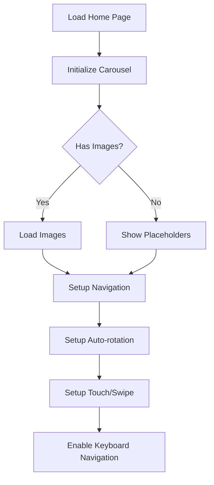
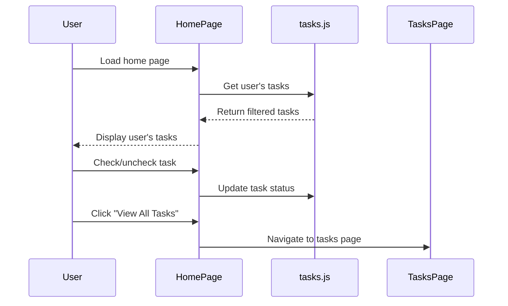
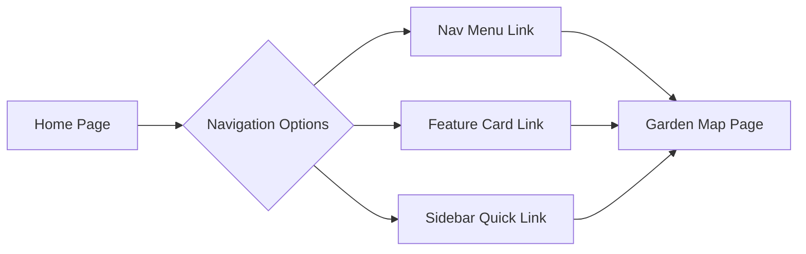

# TechServ Garden Website Home Page Improvement Plan

Based on my analysis of the code and your requirements, I've outlined a detailed plan to fix and complete the home page features, connecting them to the appropriate endpoints.

## 1. Weather Widget Enhancement

### Current State:
- The weather widget in the sidebar uses static mock data
- There's a weather.js file with functionality, but it's not properly connected
- The widget needs to be connected to a real weather API

### Implementation Plan:
1. **API Integration**:
   - Set up connection to a weather API (OpenWeatherMap or similar)
   - Create API key configuration
   - Implement fetch requests to get real-time weather data

2. **Widget Structure Updates**:
   - Modify the weather widget in index.html to include proper IDs and structure
   - Ensure it matches the expected structure in weather.js

3. **Functionality Connection**:
   - Connect the widget to the initializeWeatherWidget() function in weather.js
   - Update the main.js to properly initialize the weather widget
   - Implement error handling for API failures

## 2. Carousel Implementation

### Current State:
- The home page has a simple carousel implementation directly in HTML/JS
- There's a more robust carousel.js file that's not being utilized
- The carousel.js is looking for an element with ID 'photo-carousel' which doesn't exist

### Implementation Plan:
1. **Structure Updates**:
   - Update the carousel HTML structure in index.html to match what carousel.js expects
   - Add proper IDs and classes for the carousel elements
   - Ensure accessibility features are maintained

2. **Script Connection**:
   - Connect the carousel to the initializeCarousel() function in carousel.js
   - Remove the inline carousel JavaScript from index.html
   - Add proper image loading and error handling

3. **Visual Enhancements**:
   - Implement smooth transitions between slides
   - Add proper image captions and alt text
   - Ensure responsive behavior on different screen sizes

## 3. Tasks Integration

### Current State:
- The sidebar shows static tasks
- There's a comprehensive tasks.js file with functionality
- Tasks should be specific to the logged-in user

### Implementation Plan:
1. **User Authentication Integration**:
   - Add functionality to identify the current user
   - Implement session management for persistent user state
   - Create a user profile data structure

2. **Task Data Structure**:
   - Create a proper data model for tasks
   - Implement filtering by user
   - Add priority and completion status tracking

3. **UI Updates**:
   - Connect the sidebar tasks to the task management functionality
   - Make checkboxes interactive with proper event handling
   - Add visual feedback for task completion
   - Link to the full tasks page for more details

## 4. Garden Map Integration

### Current State:
- Garden map is mentioned as a feature but not directly accessible
- There's a comprehensive garden-map.js implementation
- Users need to be able to navigate to the garden map page

### Implementation Plan:
1. **Navigation Enhancement**:
   - Ensure the garden map button in the navigation properly links to the garden map page
   - Add a featured link in the main content area
   - Consider adding a small preview of the garden map on the home page

2. **Visual Indication**:
   - Add visual cues to highlight the garden map feature
   - Implement hover states and clear call-to-action
   - Consider adding an icon or small thumbnail

## 5. General Improvements

1. **Code Organization**:
   - Ensure proper module loading and initialization
   - Implement consistent error handling
   - Add proper comments and documentation

2. **Performance Optimization**:
   - Lazy load non-critical resources
   - Optimize image loading for the carousel
   - Implement proper caching strategies

3. **Responsive Design Enhancements**:
   - Test and fix any responsive design issues
   - Ensure proper display on mobile devices
   - Optimize touch interactions for mobile users

## Implementation Timeline

1. **Phase 1: Structure Updates** (1-2 days)
   - Update HTML structure for all components
   - Ensure proper IDs and classes
   - Set up event listeners and connections

2. **Phase 2: Weather API Integration** (1-2 days)
   - Set up API connection
   - Implement data fetching and parsing
   - Update UI with real data

3. **Phase 3: Carousel and Tasks Enhancement** (2-3 days)
   - Implement robust carousel functionality
   - Connect tasks to proper data sources
   - Add user-specific filtering

4. **Phase 4: Testing and Refinement** (1-2 days)
   - Test all features across devices
   - Fix any bugs or issues
   - Optimize performance

## Technical Considerations

- **API Keys**: Secure storage for weather API keys
- **Error Handling**: Graceful degradation if APIs are unavailable
- **Performance**: Minimize unnecessary reflows and repaints
- **Accessibility**: Ensure all features are accessible to all users
- **Browser Compatibility**: Test across major browsers